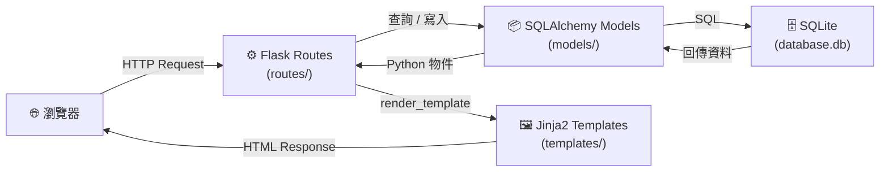
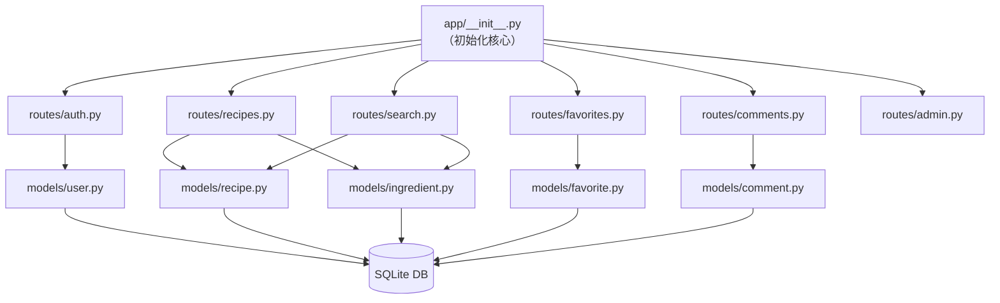

# 系統架構文件（ARCHITECTURE）

**專案名稱：** 食譜收藏夾  
**版本：** v1.0  
**建立日期：** 2026-04-09  
**依據文件：** docs/PRD.md

---

## 1. 技術架構說明

### 1.1 選用技術與原因

| 技術 | 版本建議 | 選用原因 |
|------|---------|---------|
| **Python** | 3.10+ | 語法清晰，適合初學者，Flask 生態完整 |
| **Flask** | 3.x | 輕量級 Web 框架，學習曲線低，彈性高 |
| **Jinja2** | (內建於 Flask) | 與 Flask 無縫整合，模板語法直觀 |
| **SQLite** | (內建於 Python) | 無須安裝資料庫伺服器，開發測試方便 |
| **SQLAlchemy** | 2.x | ORM 防止 SQL Injection，程式更易維護 |
| **Flask-Login** | 0.6+ | 處理登入狀態、Session 管理 |
| **Flask-WTF** | 1.x | 表單驗證 + CSRF 防護 |
| **Werkzeug** | (內建於 Flask) | 密碼雜湊（generate_password_hash / check_password_hash） |

### 1.2 Flask MVC 模式說明

本專案採用 **MVC（Model-View-Controller）** 設計模式：

| 層級 | 對應元件 | 職責 |
|------|---------|------|
| **Model** | `app/models/` | 定義資料表結構、與資料庫互動（使用 SQLAlchemy） |
| **View** | `app/templates/` | Jinja2 HTML 模板，負責呈現畫面給瀏覽器 |
| **Controller** | `app/routes/` | Flask 路由，處理 HTTP 請求、呼叫 Model、回傳 View |

```
使用者的 HTTP 請求
        ↓
  Controller（routes/）   ← 接收請求、處理邏輯
        ↓          ↑
   Model（models/）        ← 查詢或寫入資料庫
        ↓
      SQLite
        ↑
  Controller 取得資料
        ↓
   View（templates/）      ← 渲染 HTML 回傳給使用者
```

---

## 2. 專案資料夾結構

```
recipe_app/                     ← 專案根目錄
│
├── app/                        ← 主應用程式套件
│   │
│   ├── __init__.py             ← 建立 Flask app、初始化 DB、註冊 Blueprint
│   │
│   ├── models/                 ← 資料庫模型（SQLAlchemy）
│   │   ├── __init__.py
│   │   ├── user.py             ← User 使用者模型
│   │   ├── recipe.py           ← Recipe 食譜模型
│   │   ├── ingredient.py       ← Ingredient 食材模型
│   │   ├── favorite.py         ← Favorite 收藏關聯表
│   │   └── comment.py          ← Comment 留言與評分模型
│   │
│   ├── routes/                 ← Flask 路由（Controller）
│   │   ├── __init__.py
│   │   ├── auth.py             ← 帳號：註冊、登入、登出
│   │   ├── recipes.py          ← 食譜：瀏覽、新增、編輯、刪除、詳情
│   │   ├── search.py           ← 搜尋：關鍵字搜尋、食材搜尋
│   │   ├── favorites.py        ← 收藏：加入/取消收藏、我的收藏清單
│   │   ├── comments.py         ← 留言：新增留言、評分
│   │   └── admin.py            ← 管理員後台：用戶管理、內容審核
│   │
│   ├── templates/              ← Jinja2 HTML 模板（View）
│   │   ├── base.html           ← 公用版型（導覽列、頁尾）
│   │   ├── auth/
│   │   │   ├── login.html      ← 登入頁
│   │   │   └── register.html   ← 註冊頁
│   │   ├── recipes/
│   │   │   ├── index.html      ← 食譜列表（首頁）
│   │   │   ├── detail.html     ← 食譜詳情頁
│   │   │   ├── create.html     ← 新增食譜頁
│   │   │   └── edit.html       ← 編輯食譜頁
│   │   ├── search/
│   │   │   └── results.html    ← 搜尋結果頁（關鍵字 & 食材）
│   │   ├── user/
│   │   │   ├── profile.html    ← 個人主頁（我的食譜 + 我的收藏）
│   │   │   └── favorites.html  ← 收藏清單頁
│   │   └── admin/
│   │       ├── dashboard.html  ← 管理員總覽
│   │       ├── users.html      ← 用戶管理頁
│   │       └── recipes.html    ← 食譜審核頁
│   │
│   ├── static/                 ← 靜態資源
│   │   ├── css/
│   │   │   └── style.css       ← 全站樣式
│   │   ├── js/
│   │   │   ├── ingredient_tag.js  ← 食材標籤輸入元件
│   │   │   └── star_rating.js     ← 星級評分元件
│   │   └── uploads/            ← 使用者上傳的食譜封面圖片
│   │
│   └── forms/                  ← Flask-WTF 表單定義
│       ├── __init__.py
│       ├── auth_forms.py       ← 登入、註冊表單
│       ├── recipe_forms.py     ← 食譜新增/編輯表單
│       └── comment_forms.py    ← 留言、評分表單
│
├── instance/
│   └── database.db             ← SQLite 資料庫（不納入 git）
│
├── migrations/                 ← 資料庫遷移（若使用 Flask-Migrate）
│
├── tests/                      ← 單元測試（選用）
│   └── test_routes.py
│
├── app.py                      ← 程式入口（執行 Flask app）
├── config.py                   ← 設定檔（SECRET_KEY、DB 路徑等）
├── requirements.txt            ← Python 套件清單
└── .env                        ← 環境變數（不納入 git）
```

---

## 3. 元件關係圖

### 3.1 整體請求流程



### 3.2 模組依賴關係



---

## 4. 關鍵設計決策

### 決策一：使用 Flask Blueprint 模組化路由

**做法：** 將不同功能的路由分拆到獨立的 Blueprint（auth、recipes、search、admin…），再在 `app/__init__.py` 統一註冊。

**原因：**
- 避免所有路由塞在單一 `app.py` 導致難以維護
- 每個模組可由不同組員獨立開發，降低衝突

---

### 決策二：使用 SQLAlchemy ORM 取代原生 sqlite3

**做法：** 定義 Python Class 作為資料表模型，透過 ORM 方法操作資料庫。

**原因：**
- 自動防止 SQL Injection（參數化查詢）
- 資料模型有明確型別，減少程式錯誤
- 未來若需換成 PostgreSQL，幾乎不需修改業務邏輯

---

### 決策三：使用 Flask-Login 管理登入狀態

**做法：** 透過 `@login_required` 裝飾器保護需要登入的路由，`current_user` 取得當前使用者。

**原因：**
- 統一的 Session 管理，不需手動讀寫 `session['user_id']`
- 輕易區分「已登入用戶」與「管理員」的存取權限

---

### 決策四：食材搜尋採用多對多關聯設計

**做法：** `Recipe` 與 `Ingredient` 之間建立多對多關聯表（`recipe_ingredients`），食材搜尋時用 JOIN 查詢。

**原因：**
- 一道食譜有多種食材；一種食材出現在多道食譜中
- 多對多設計讓「從食材反查食譜」的 SQL 查詢更有效率
- 可精確計算匹配食材數量，實現「匹配度排序」

---

### 決策五：圖片儲存在伺服器本地（static/uploads/）

**做法：** 使用者上傳的食譜封面圖片儲存在 `app/static/uploads/` 資料夾，資料庫只儲存檔名。

**原因：**
- 不依賴外部雲端服務（如 AWS S3），降低開發複雜度
- 適合學校伺服器環境
- 需注意：正式上線時應限制上傳大小與副檔名，並避免直接使用原始檔名

---

## 5. 安全設計對照表

| 威脅 | 對應機制 |
|------|---------|
| SQL Injection | SQLAlchemy ORM 參數化查詢 |
| CSRF 攻擊 | Flask-WTF 自動產生 CSRF Token |
| 密碼洩露 | Werkzeug `generate_password_hash` 雜湊儲存 |
| 未授權存取 | `@login_required` + 角色判斷（is_admin） |
| 惡意圖片上傳 | 驗證副檔名（`.jpg/.png/.webp`）+ MIME Type 檢查 |
