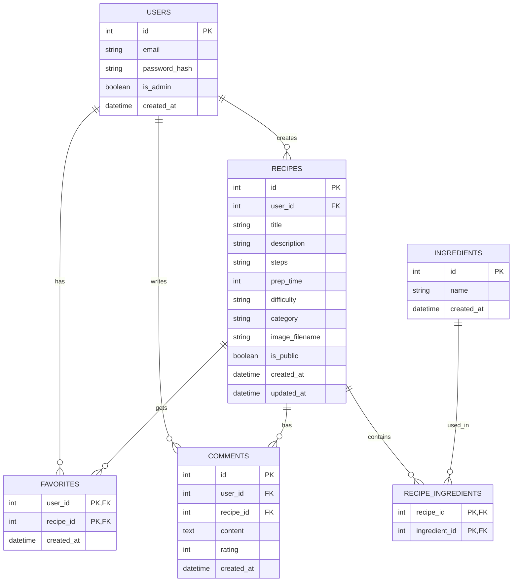

# 資料庫設計文件（DB DESIGN）

本文件根據產品需求文件（PRD）與流程圖（FLOWCHART）產出，描述「食譜收藏夾」的資料庫綱要與關聯設計。

## 1. 實體關聯圖（ER Diagram）

## 2. 資料表詳細說明

### 2.1 USERS (使用者)
儲存使用者的登入資訊與權限。
- `id`: INTEGER, Primary Key, 自動遞增
- `email`: VARCHAR(255), 必填, 唯一值
- `password_hash`: VARCHAR(255), 必填（儲存雜湊密碼）
- `is_admin`: BOOLEAN, 預設 false
- `created_at`: DATETIME, 建立時間

### 2.2 RECIPES (食譜)
儲存每份食譜的詳細內容與屬性。
- `id`: INTEGER, Primary Key, 自動遞增
- `user_id`: INTEGER, Foreign Key (USERS.id), 必填
- `title`: VARCHAR(100), 必填
- `description`: TEXT, 簡述
- `steps`: TEXT, 必填（儲存烹調步驟）
- `prep_time`: INTEGER, 烹調時間（分鐘）
- `difficulty`: VARCHAR(50), 難易度
- `category`: VARCHAR(50), 分類
- `image_filename`: VARCHAR(255), 封面圖片檔名
- `is_public`: BOOLEAN, 預設 true（公開）
- `created_at`: DATETIME, 建立時間
- `updated_at`: DATETIME, 最後更新時間

### 2.3 INGREDIENTS (食材)
儲存所有可能的食材標籤。
- `id`: INTEGER, Primary Key, 自動遞增
- `name`: VARCHAR(100), 必填, 唯一值
- `created_at`: DATETIME, 建立時間

### 2.4 RECIPE_INGREDIENTS (食譜與食材關聯)
多對多中介表，紀錄食譜使用了哪些食材。
- `recipe_id`: INTEGER, Primary Key, Foreign Key (RECIPES.id)
- `ingredient_id`: INTEGER, Primary Key, Foreign Key (INGREDIENTS.id)

### 2.5 FAVORITES (我的最愛)
多對多中介表，紀錄哪些使用者收藏了哪些食譜。
- `user_id`: INTEGER, Primary Key, Foreign Key (USERS.id)
- `recipe_id`: INTEGER, Primary Key, Foreign Key (RECIPES.id)
- `created_at`: DATETIME, 建立時間

### 2.6 COMMENTS (留言與評分)
儲存使用者針對食譜所留下的評論及星級分數。
- `id`: INTEGER, Primary Key, 自動遞增
- `user_id`: INTEGER, Foreign Key (USERS.id), 必填
- `recipe_id`: INTEGER, Foreign Key (RECIPES.id), 必填
- `content`: TEXT, 必填
- `rating`: INTEGER, 評分（1~5）
- `created_at`: DATETIME, 建立時間
