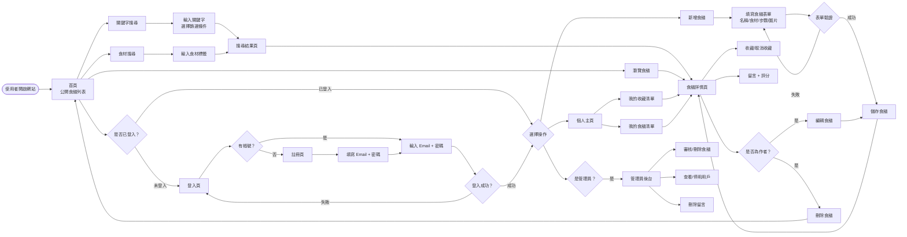
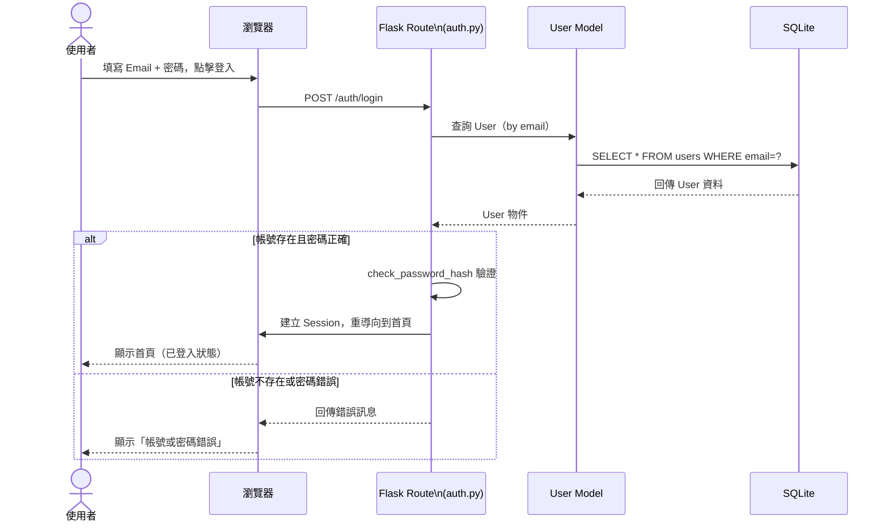
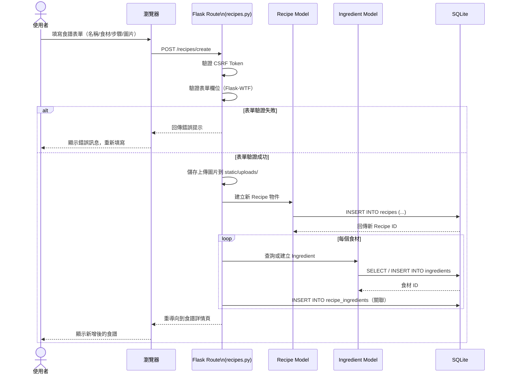
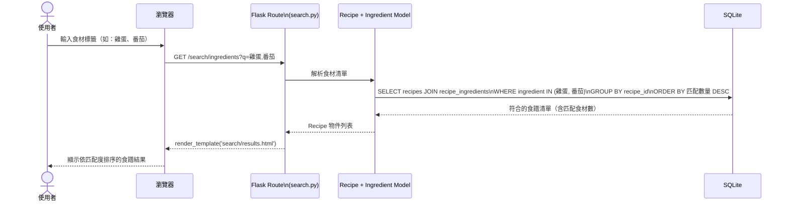
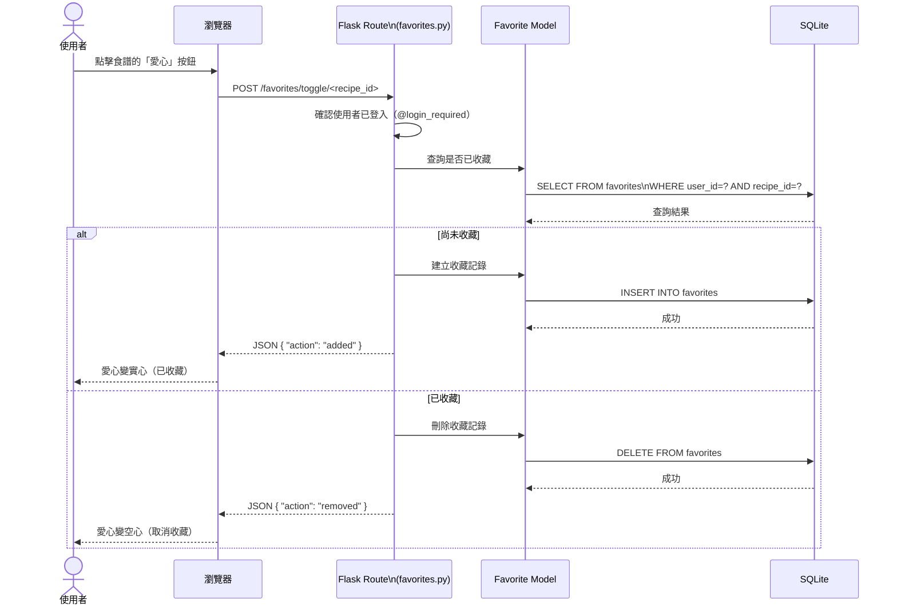

# 流程圖文件（FLOWCHART）

**專案名稱：** 食譜收藏夾  
**版本：** v1.0  
**建立日期：** 2026-04-09  
**依據文件：** docs/PRD.md、docs/ARCHITECTURE.md

---

## 1. 使用者流程圖（User Flow）

描述使用者從進入網站到完成各項操作的完整路徑。

---

## 2. 系統序列圖（Sequence Diagram）

### 2.1 使用者登入流程

---

### 2.2 新增食譜流程

---

### 2.3 食材搜尋食譜流程

---

### 2.4 收藏食譜流程

---

## 3. 功能清單對照表

| # | 功能 | URL 路徑 | HTTP 方法 | 權限 |
|---|------|---------|----------|------|
| 1 | 首頁（食譜列表） | `/` | GET | 公開 |
| 2 | 使用者註冊 | `/auth/register` | GET / POST | 未登入 |
| 3 | 使用者登入 | `/auth/login` | GET / POST | 未登入 |
| 4 | 使用者登出 | `/auth/logout` | POST | 已登入 |
| 5 | 食譜詳情頁 | `/recipes/<id>` | GET | 公開 |
| 6 | 新增食譜 | `/recipes/create` | GET / POST | 已登入 |
| 7 | 編輯食譜 | `/recipes/<id>/edit` | GET / POST | 作者本人 / 管理員 |
| 8 | 刪除食譜 | `/recipes/<id>/delete` | POST | 作者本人 / 管理員 |
| 9 | 關鍵字搜尋 | `/search?q=<keyword>` | GET | 公開 |
| 10 | 食材搜尋 | `/search/ingredients?q=<食材>` | GET | 公開 |
| 11 | 收藏/取消收藏 | `/favorites/toggle/<recipe_id>` | POST | 已登入 |
| 12 | 我的收藏清單 | `/user/favorites` | GET | 已登入 |
| 13 | 個人主頁 | `/user/profile` | GET | 已登入 |
| 14 | 新增留言/評分 | `/recipes/<id>/comments` | POST | 已登入 |
| 15 | 管理員 — 總覽 | `/admin/` | GET | 管理員 |
| 16 | 管理員 — 食譜管理 | `/admin/recipes` | GET / POST | 管理員 |
| 17 | 管理員 — 用戶管理 | `/admin/users` | GET / POST | 管理員 |
| 18 | 管理員 — 刪除留言 | `/admin/comments/<id>/delete` | POST | 管理員 |
